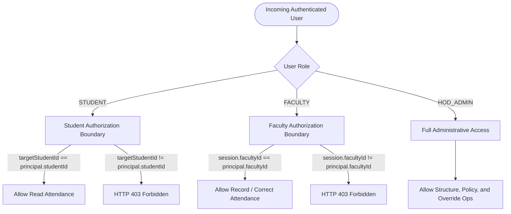

# Application Architecture & Layer Boundaries

## 1. Clean Hexagonal Layering

AMCS adheres to strict separation between user-facing web protocols, application use cases, pure domain calculations, and database infrastructure:

```
┌─────────────────────────────────────────────────────────────┐
│  Presentation Layer (com.amcs.infrastructure.web)          │
│  - REST Controllers (@RestController, /api/v1/*)            │
│  - Bean Validation (@Valid, @NotNull, @Size)                │
│  - Global Exception Handler (@RestControllerAdvice)         │
│  - OpenAPI / Swagger Documentation                         │
└──────────────────────────────┬──────────────────────────────┘
                               │ DTOs (Request / Response)
                               ▼
┌─────────────────────────────────────────────────────────────┐
│  Application Layer (com.amcs.application)                   │
│  - Application Services / Use Cases                         │
│  - Transaction Orchestration (@Transactional)               │
│  - Output Repository Port Interfaces (port.out.*)           │
│  - Security Context & Authorization Boundaries              │
└──────────────┬──────────────────────────────┬───────────────┘
               │ Domain Models                │ Invocations
               ▼                              ▼
┌──────────────────────────────┐ ┌────────────────────────────┐
│ Pure Domain Layer            │ │ Infrastructure Persistence │
│ (com.amcs.domain.*)          │ │ (com.amcs.infrastructure.  │
│ - 100% Framework Free        │ │  persistence)              │
│ - Calculation Engines        │ │ - Persistence Adapters     │
│ - Domain Integrity Validator │ │ - Spring Data JPA Repos    │
│ - Immutable Value Records    │ │ - JPA Entities & Mappers   │
└──────────────────────────────┘ └────────────────────────────┘
```

---

## 2. Application Service Use-Case Boundaries

| Application Service | Core Business Responsibilities | Transaction Demarcation |
| :--- | :--- | :--- |
| **`StudentApplicationService`** | Register students, lookup by ID/RegNo, update contact info, paginated searches. | Read-Only default, `@Transactional` on writes |
| **`AcademicStructureApplicationService`** | Maintain departments, semesters/periods, sections, and curriculum subjects. | Read-Only default, `@Transactional` on writes |
| **`FacultyApplicationService`** | Faculty onboarding, department assignments, faculty lookup. | Read-Only default, `@Transactional` on writes |
| **`EnrollmentApplicationService`** | Enroll student in section, execute section transfers (ending old enrollment and creating new), query temporal history. | `@Transactional(rollbackFor = Exception.class)` |
| **`LabGroupApplicationService`** | Create section lab divisions, assign students to lab groups, record group membership transitions. | `@Transactional(rollbackFor = Exception.class)` |
| **`SessionApplicationService`** | Timetable sessions, validate planned units ($\ge 1$), cancel sessions (conducted units = 0), reschedule to replacement session. | `@Transactional(rollbackFor = Exception.class)` with `@Version` |
| **`AttendanceRecordingApplicationService`** | Atomic roll-call submission for a session, verify student eligibility & lab group, run `AttendanceIntegrityValidator`, atomic insert, transition to `CONDUCTED`. Attendance corrections with audit capture. | `@Transactional(isolation = READ_COMMITTED, rollbackFor = Exception.class)` |
| **`AttendanceCalculationApplicationService`** | Orchestrate fact gathering for a student, invoke pure `AttendanceCalculationEngine`, return immutable calculations, shortages, and predictions. | `@Transactional(readOnly = true)` |
| **`PolicyApplicationService`** | Create immutable policy versions, query active version for subject/period, list historical versions. | Read-Only default, `@Transactional` on version creation |

---

## 3. Concurrency & Locking Strategy

1. **Optimistic Locking on Sessions (`@Version`):**
   * Sessions are mutable aggregate roots. Concurrent faculty actions (e.g. attendance submission vs. cancellation vs. rescheduling) are guarded by `@Version` on `SessionEntity`.
   * On concurrent edit conflict, Hibernate throws `OptimisticLockException`, which the global handler translates to **HTTP 409 Conflict** (`OPTIMISTIC_LOCK_CONFLICT`).
2. **Attendance Records as Immutable Events:**
   * Individual attendance records do not carry `@Version`.
   * Uniqueness is strictly guaranteed by database constraint `uq_attendance_session_student`.
   * Corrections bump the parent session version and create an auditable mutation event.

---

## 4. Authorization Boundary Specification (Pre-Security Preparation)

The application layer models explicit authorization guards:


These boundaries are enforced in application services before executing business logic.
