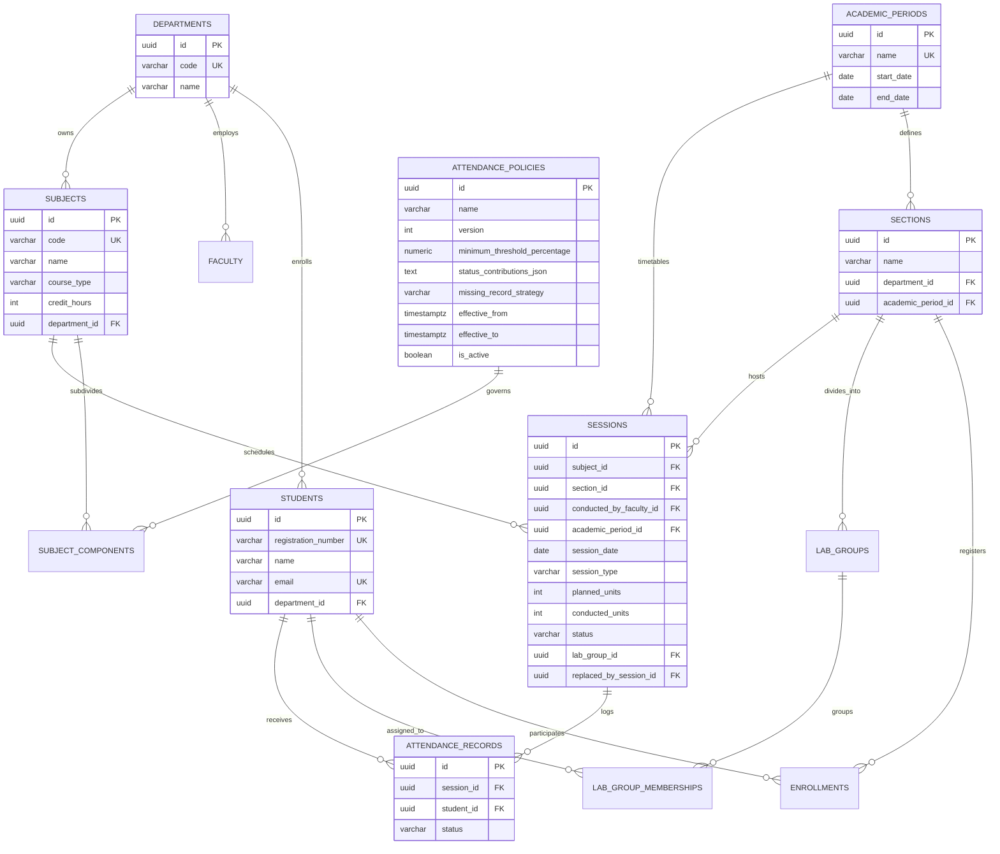

# Database Design & Relational Schema

## 1. Entity Relationship (ER) Diagram



---

## 2. Table Specifications & Constraints

### 2.1 `departments`
* `id` UUID PRIMARY KEY
* `code` VARCHAR(20) NOT NULL UNIQUE
* `name` VARCHAR(100) NOT NULL
* `created_at`, `updated_at` TIMESTAMPTZ NOT NULL

### 2.2 `faculty`
* `id` UUID PRIMARY KEY
* `employee_id` VARCHAR(30) NOT NULL UNIQUE
* `name` VARCHAR(100) NOT NULL
* `email` VARCHAR(100) NOT NULL UNIQUE
* `department_id` UUID NOT NULL REFERENCES `departments(id)` ON DELETE RESTRICT

### 2.3 `students`
* `id` UUID PRIMARY KEY
* `registration_number` VARCHAR(30) NOT NULL UNIQUE
* `name` VARCHAR(100) NOT NULL
* `email` VARCHAR(100) NOT NULL UNIQUE
* `department_id` UUID NOT NULL REFERENCES `departments(id)` ON DELETE RESTRICT

### 2.4 `academic_periods`
* `id` UUID PRIMARY KEY
* `name` VARCHAR(100) NOT NULL UNIQUE
* `start_date` DATE NOT NULL
* `end_date` DATE NOT NULL
* **Constraint:** `CONSTRAINT chk_period_dates CHECK (end_date >= start_date)`

### 2.5 `sections`
* `id` UUID PRIMARY KEY
* `name` VARCHAR(50) NOT NULL
* `department_id` UUID NOT NULL REFERENCES `departments(id)` ON DELETE RESTRICT
* `academic_period_id` UUID NOT NULL REFERENCES `academic_periods(id)` ON DELETE RESTRICT
* **Constraint:** `CONSTRAINT uq_section_name_period UNIQUE (department_id, academic_period_id, name)`

### 2.6 `subjects`
* `id` UUID PRIMARY KEY
* `code` VARCHAR(20) NOT NULL UNIQUE
* `name` VARCHAR(100) NOT NULL
* `course_type` VARCHAR(40) NOT NULL (`THEORY`, `LABORATORY`, `THEORY_INTEGRATED_LABORATORY`)
* `credit_hours` INT NOT NULL CHECK (`credit_hours >= 0`)
* `department_id` UUID NOT NULL REFERENCES `departments(id)` ON DELETE RESTRICT

### 2.7 `subject_components`
* `id` UUID PRIMARY KEY
* `subject_id` UUID NOT NULL REFERENCES `subjects(id)` ON DELETE RESTRICT
* `component_type` VARCHAR(20) NOT NULL (`THEORY`, `LAB`)
* `policy_id` UUID NOT NULL REFERENCES `attendance_policies(id)` ON DELETE RESTRICT
* **Constraint:** `CONSTRAINT uq_subject_component UNIQUE (subject_id, component_type)`

### 2.8 `lab_groups`
* `id` UUID PRIMARY KEY
* `name` VARCHAR(50) NOT NULL
* `section_id` UUID NOT NULL REFERENCES `sections(id)` ON DELETE RESTRICT
* **Constraint:** `CONSTRAINT uq_lab_group_name UNIQUE (section_id, name)`

### 2.9 `enrollments`
* `id` UUID PRIMARY KEY
* `student_id` UUID NOT NULL REFERENCES `students(id)` ON DELETE RESTRICT
* `section_id` UUID NOT NULL REFERENCES `sections(id)` ON DELETE RESTRICT
* `enrollment_start` DATE NOT NULL
* `enrollment_end` DATE NULL
* `status` VARCHAR(30) NOT NULL DEFAULT 'ACTIVE'
* **Constraint:** `CONSTRAINT chk_enrollment_dates CHECK (enrollment_end IS NULL OR enrollment_end >= enrollment_start)`

### 2.10 `lab_group_memberships`
* `id` UUID PRIMARY KEY
* `student_id` UUID NOT NULL REFERENCES `students(id)` ON DELETE RESTRICT
* `lab_group_id` UUID NOT NULL REFERENCES `lab_groups(id)` ON DELETE RESTRICT
* `effective_start` DATE NOT NULL
* `effective_end` DATE NULL
* **Constraint:** `CONSTRAINT chk_membership_dates CHECK (effective_end IS NULL OR effective_end >= effective_start)`

### 2.11 `sessions`
* `id` UUID PRIMARY KEY
* `subject_id` UUID NOT NULL REFERENCES `subjects(id)` ON DELETE RESTRICT
* `section_id` UUID NOT NULL REFERENCES `sections(id)` ON DELETE RESTRICT
* `conducted_by_faculty_id` UUID NOT NULL REFERENCES `faculty(id)` ON DELETE RESTRICT
* `academic_period_id` UUID NOT NULL REFERENCES `academic_periods(id)` ON DELETE RESTRICT
* `session_date` DATE NOT NULL
* `session_type` VARCHAR(20) NOT NULL (`THEORY`, `LAB`)
* `planned_units` INT NOT NULL CHECK (`planned_units >= 1`)
* `conducted_units` INT NOT NULL CHECK (`conducted_units >= 0`)
* `status` VARCHAR(30) NOT NULL (`SCHEDULED`, `CONDUCTED`, `CANCELLED`, `RESCHEDULED`)
* `lab_group_id` UUID NULL REFERENCES `lab_groups(id)` ON DELETE RESTRICT
* `replaced_by_session_id` UUID NULL REFERENCES `sessions(id)` ON DELETE SET NULL
* **Domain Invariant Check Constraint:**
  ```sql
  CONSTRAINT chk_session_conducted_units CHECK (
      (status = 'CONDUCTED' AND conducted_units >= 1) OR
      (status != 'CONDUCTED' AND conducted_units = 0)
  )
  ```

### 2.12 `attendance_records`
* `id` UUID PRIMARY KEY
* `session_id` UUID NOT NULL REFERENCES `sessions(id)` ON DELETE RESTRICT
* `student_id` UUID NOT NULL REFERENCES `students(id)` ON DELETE RESTRICT
* `status` VARCHAR(30) NOT NULL (`PRESENT`, `ABSENT`, `DUTY_LEAVE`, `MEDICAL_LEAVE`, `ON_DUTY`)
* **Critical Unique Constraint:**
  ```sql
  CONSTRAINT uq_attendance_session_student UNIQUE (session_id, student_id)
  ```
  Guarantees at the storage engine level that duplicate student records for a session cannot be inserted concurrently.

### 2.13 `attendance_policies`
* `id` UUID PRIMARY KEY
* `name` VARCHAR(100) NOT NULL
* `version` INT NOT NULL CHECK (`version >= 1`)
* `minimum_threshold_percentage` NUMERIC(5,2) NOT NULL CHECK (`minimum_threshold_percentage >= 0 AND minimum_threshold_percentage <= 100`)
* `status_contributions_json` TEXT NOT NULL (JSON-encoded status weight map)
* `missing_record_strategy` VARCHAR(40) NOT NULL DEFAULT 'TREAT_AS_ABSENT'
* `effective_from` TIMESTAMPTZ NOT NULL
* `effective_to` TIMESTAMPTZ NULL
* `is_active` BOOLEAN NOT NULL DEFAULT TRUE
* **Constraint:** `CONSTRAINT uq_policy_name_version UNIQUE (name, version)`

---

## 3. Database Indexes

| Index Name | Table | Columns | Purpose |
| :--- | :--- | :--- | :--- |
| `idx_sessions_lookup` | `sessions` | `(subject_id, academic_period_id, session_date)` | Accelerates subject-level session filtering for calculation |
| `idx_sessions_section` | `sessions` | `(section_id, session_date)` | Accelerates section timetable queries |
| `idx_attendance_records_student` | `attendance_records` | `(student_id, session_id)` | Accelerates fetching student records across a semester |
| `idx_attendance_records_session` | `attendance_records` | `(session_id)` | Accelerates faculty session roll-call retrieval |
| `idx_enrollments_student_active` | `enrollments` | `(student_id, enrollment_start, enrollment_end)` | Accelerates student active enrollment verification |
| `idx_lab_memberships_student` | `lab_group_memberships` | `(student_id, effective_start, effective_end)` | Accelerates lab group cohort membership checks |

---

## 4. Migration & Local Database Strategy

1. **Flyway Migrations:** All DDL scripts are located under `src/main/resources/db/migration/`.
   - `V1__initial_schema.sql`: Authoritative schema creation.
   - `spring.jpa.hibernate.ddl-auto=validate`: Hibernate validates metadata against PostgreSQL upon application boot. Hibernate is forbidden from mutating schema.
2. **Local PostgreSQL via Docker Compose:**
   - Execute: `docker compose up -d`
   - Configured with persistent named volume `amcs_postgres_data` and healthcheck.
