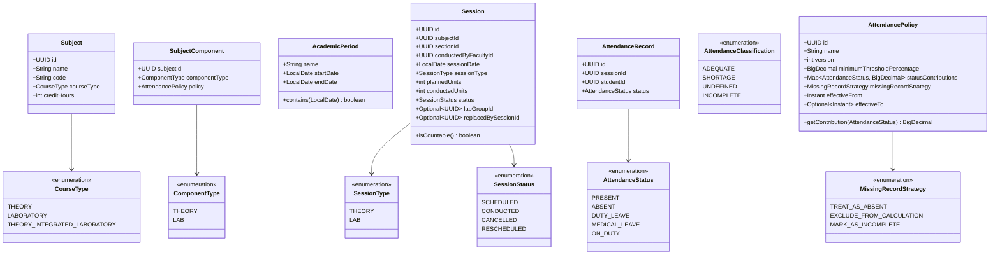

# Attendance Management and Calculation System (AMCS)
# DOMAIN_MODEL.md — Phase 1 & 1.5: Domain Model Architecture

**Document Status:** Complete — Phase 1.5 Hardening Baseline  
**Version:** 1.1.0  
**Date:** 2026-08-29  
**Module:** `attendance-domain` (`com.amcs.domain.*`)

---

## 1. Executive Summary & Design Philosophy

The core domain model of the Attendance Management and Calculation System (AMCS) is engineered as an **isolated, dependency-free domain kernel**. It possesses zero framework annotations (no `@Entity`, no `@Table`, no Spring annotations), zero network/HTTP references, and zero persistence code. 

### Key Architectural Principles
1. **Purity & Immutability:** Core domain entities and value objects are modeled as Java `record`s or immutable objects. State transitions create new instances.
2. **Explicit Conducted Units (Planned vs. Conducted):** A class period or laboratory session carries both `plannedUnits` (timetable schedule, $\ge 1$) and `conductedUnits` (actual instruction held). A cancelled session conducts strictly 0 units.
3. **Temporal Gatekeeping:** Students are evaluated strictly within their temporal enrollment window (`Enrollment.isActiveOn(date)`). Sessions outside their window do not contribute to their denominator.
4. **Sub-Group Scoping:** Laboratory sessions assigned to specific lab groups (e.g., Group A) only evaluate students enrolled in that group.
5. **Configurable Missing Record Policy:** Sessions lacking an attendance record for an enrolled student are handled dynamically via `MissingRecordStrategy` (`TREAT_AS_ABSENT`, `EXCLUDE_FROM_CALCULATION`, `MARK_AS_INCOMPLETE`).
6. **Data Integrity Assurance:** Detects data corruption (unenrolled attendance, wrong lab group, duplicate entries, cancelled session records, subject mismatches) via `AttendanceIntegrityValidator`.
7. **Decoupled Condonation Boundary:** Condonation is strictly a downstream, post-calculation layer that evaluates already-computed shortage results.

---

## 2. Package Architecture

```
com.amcs.domain/
├── academic/          # Curricular structure, subjects, periods, and component definitions
├── attendance/        # Sessions, records, statuses, classifications, and integrity validator
├── enrollment/        # Student memberships, temporal validity, and lab group splits
├── policy/            # Policy definitions, status contributions, missing record strategies, and aggregation strategies
└── calculation/       # Pure calculators, mathematical solvers, results, and facade
    └── result/        # Immutable result value objects (Subject, Component, Integrated, Overall, Shortage, Prediction)
```

---

## 3. Domain Model Class Diagram



---

## 4. Entity & Value Object Catalog

### 4.1 Academic Package (`com.amcs.domain.academic`)
* **`AcademicPeriod`**: Represents an institutionally defined time window (e.g., "Odd Semester 2026", 2026-07-01 to 2026-11-30). Enforces `endDate >= startDate`.
* **`CourseType`**: Differentiates between pure `THEORY`, pure `LABORATORY`, and `THEORY_INTEGRATED_LABORATORY`.
* **`ComponentType`**: Identifies whether a component inside an integrated subject is `THEORY` or `LAB`.
* **`Subject`**: Identifies an academic course. Retains credit hours for credit-weighted aggregations. Does not embed mutable policies directly, allowing policy versioning over time.
* **`SubjectComponent`**: Pairs an integrated subject with its component type (`THEORY`/`LAB`) and its dedicated `AttendancePolicy`.

### 4.2 Attendance Package (`com.amcs.domain.attendance`)
* **`Session`**: Atomic instruction slot. Holds `plannedUnits` ($\ge 1$), `conductedUnits` (0 if cancelled, $\ge 1$ if conducted), `status`, optional `labGroupId`, and optional `replacedBySessionId`.
* **`AttendanceRecord`**: Immutable pairing of student attendance to a session.
* **`AttendanceStatus`**: Enumerates standard statuses: `PRESENT`, `ABSENT`, `DUTY_LEAVE`, `MEDICAL_LEAVE`, `ON_DUTY`.
* **`AttendanceClassification`**: Evaluation status: `ADEQUATE`, `SHORTAGE`, `UNDEFINED`, or `INCOMPLETE`.
* **`AttendanceIntegrityValidator`**: Domain validator inspecting datasets for 7 corruption scenarios (`STUDENT_NOT_ENROLLED`, `WRONG_LAB_GROUP`, `DUPLICATE_RECORD`, `SESSION_NOT_CONDUCTED`, `OUTSIDE_ACADEMIC_PERIOD`, `SUBJECT_MISMATCH`, `UNKNOWN_SESSION`). Produces `AttendanceIntegrityReport`.

### 4.3 Policy Package (`com.amcs.domain.policy`)
* **`AttendancePolicy`**: Defines calculation parameters: threshold, status contribution map, missing record strategy, version, and validity timestamps.
* **`MissingRecordStrategy`**: Controls handling of missing records (`TREAT_AS_ABSENT`, `EXCLUDE_FROM_CALCULATION`, `MARK_AS_INCOMPLETE`).
* **`IntegratedSubjectPolicy`**: Governs theory/lab combinations (`SEPARATE_THRESHOLDS`, `COMBINED_ALL_SESSIONS`, `WEIGHTED_AVERAGE`).
* **`OverallAttendancePolicy`**: Governs institutional aggregation across 4 distinct strategies (`ARITHMETIC_MEAN`, `WEIGHTED_BY_CREDITS`, `AGGREGATE_UNITS`, `AGGREGATE_HOURS`).
* **`CondonationPolicy`**: Isolated post-calculation placeholder.
