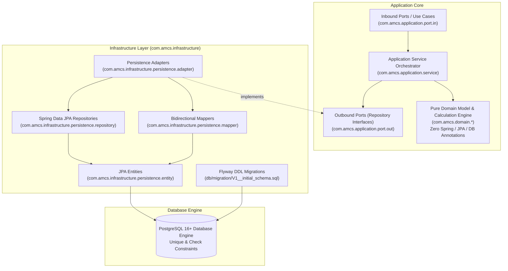

# Persistence Architecture

## 1. Architectural Philosophy: Strict Hexagonal Isolation

The Attendance Management and Calculation System (AMCS) enforces a strict **Hexagonal Architecture (Ports & Adapters)**. 

The domain layer (`com.amcs.domain.*`) is **100% pure Java** with zero framework dependencies. It contains no annotations from JPA, Hibernate, Spring, or Jackson.



---

## 2. Package Organization

| Package | Responsibility | Framework Dependencies |
| :--- | :--- | :--- |
| `com.amcs.domain.*` | Pure academic, attendance, enrollment, and policy domain models and calculation engines. | **NONE** (Standard Java 21 library only) |
| `com.amcs.application.port.out` | Outbound repository interfaces defining data access contracts in domain terms. | Standard Java 21 only |
| `com.amcs.application.service` | Orchestrates retrieval via ports, transformation to domain models, calculation engine execution, and result dispatch. | `@Service`, `@Transactional` |
| `com.amcs.infrastructure.persistence.entity` | JPA entities mapping directly to relational tables. | `@Entity`, `@Table`, `@Column`, `@Id` |
| `com.amcs.infrastructure.persistence.repository` | Spring Data JPA interfaces providing Spring-managed queries. | `JpaRepository`, `@Repository`, `@Query` |
| `com.amcs.infrastructure.persistence.mapper` | Bidirectional translators between domain records and JPA entities. | `@Component`, Jackson `ObjectMapper` |
| `com.amcs.infrastructure.persistence.adapter` | Concrete implementations of application repository ports bridging domain and JPA. | `@Component` |

---

## 3. Domain Object to Persistence Model Mapping

| Domain Concept | Domain Type | Relational Entity / Table | Mapping Strategy | Key Architectural Invariant |
| :--- | :--- | :--- | :--- | :--- |
| **Student** | Pure Java Record | `StudentEntity` (`students`) | 1-to-1 table | Unique `registration_number` and `email` |
| **Department** | Pure Java Concept | `DepartmentEntity` (`departments`) | 1-to-1 table | Unique `code` |
| **Faculty** | Pure Java Concept | `FacultyEntity` (`faculty`) | 1-to-1 table | Unique `employee_id` and `email` |
| **Academic Period** | `AcademicPeriod` (record) | `AcademicPeriodEntity` (`academic_periods`) | 1-to-1 table | Check constraint: `end_date >= start_date` |
| **Section** | Section Context | `SectionEntity` (`sections`) | 1-to-1 table | Unique per department, period, and name |
| **Subject** | `Subject` (record) | `SubjectEntity` (`subjects`) | 1-to-1 table | Unique `code`, non-negative `credit_hours` |
| **Subject Component** | `SubjectComponent` (record) | `SubjectComponentEntity` (`subject_components`) | 1-to-1 table | Unique `(subject_id, component_type)` |
| **Lab Group** | `LabGroup` (record) | `LabGroupEntity` (`lab_groups`) | 1-to-1 table | Unique `(section_id, name)` |
| **Enrollment** | `Enrollment` (record) | `EnrollmentEntity` (`enrollments`) | 1-to-1 table | Temporal validity: `enrollment_end >= enrollment_start` |
| **Lab Membership** | Lab cohort mapping | `LabGroupMembershipEntity` (`lab_group_memberships`) | 1-to-1 table | Temporal validity: `effective_end >= effective_start` |
| **Session** | `Session` (record) | `SessionEntity` (`sessions`) | 1-to-1 table | Check constraint: `(CONDUCTED && conducted >= 1) \|\| (!CONDUCTED && conducted == 0)` |
| **Attendance Record** | `AttendanceRecord` (record) | `AttendanceRecordEntity` (`attendance_records`) | 1-to-1 table | **Database Unique:** `(session_id, student_id)` |
| **Attendance Policy** | `AttendancePolicy` (record) | `AttendancePolicyEntity` (`attendance_policies`) | 1-to-1 table + JSONB | Immutable versioning: unique `(name, version)` |
| **Overall Policy** | `OverallAttendancePolicy` (record) | `OverallAttendancePolicyEntity` (`overall_attendance_policies`) | 1-to-1 table | Immutable versioning: unique `(name, version)` |

---

## 4. Policy Persistence & Historical Reproducibility

Institutional attendance calculations must remain **reproducible across time**. If a semester calculation was run in 2025 using Policy Version 1, changing the threshold to 80% for 2026 must never alter the 2025 calculation.

1. **Immutable Snapshots:** `attendance_policies` persists a complete configuration snapshot, including:
   - `version` (strictly monotonic integer per policy name)
   - `minimum_threshold_percentage` (stored as `NUMERIC(5,2)`)
   - `status_contributions_json` (TEXT/JSONB storing `Map<AttendanceStatus, BigDecimal>`)
   - `missing_record_strategy` (`TREAT_AS_ABSENT`, `EXCLUDE_FROM_CALCULATION`, `MARK_AS_INCOMPLETE`)
   - `effective_from` / `effective_to` timestamps
2. **Version Uniqueness:** `CONSTRAINT uq_policy_name_version UNIQUE (name, version)` ensures version numbers cannot be overwritten or reused.
3. **Audit History:** Historical policies are marked inactive (`is_active = false`) rather than being modified or deleted.

---

## 5. End-to-End Persistence Roundtrip Workflow

The complete calculation flow from the database to the pure calculation engine is:

```
PostgreSQL Database
       │ (Spring Data JPA)
       ▼
AttendanceRecordEntity, SessionEntity, EnrollmentEntity, AttendancePolicyEntity
       │ (Persistence Mappers)
       ▼
AttendanceRecord, Session, Enrollment, AttendancePolicy (Pure Domain Objects)
       │ (Passed into AttendanceCalculationEngine)
       ▼
SubjectAttendanceCalculator & ShortageCalculator (Pure Math & Domain Rules)
       │
       ▼
SubjectAttendanceResult & OverallAttendanceResult (Immutable Domain Results)
```

The domain calculation engine has no knowledge of JDBC, Hibernate, or SQL, ensuring maximum performance, unit testability, and zero framework lock-in.
