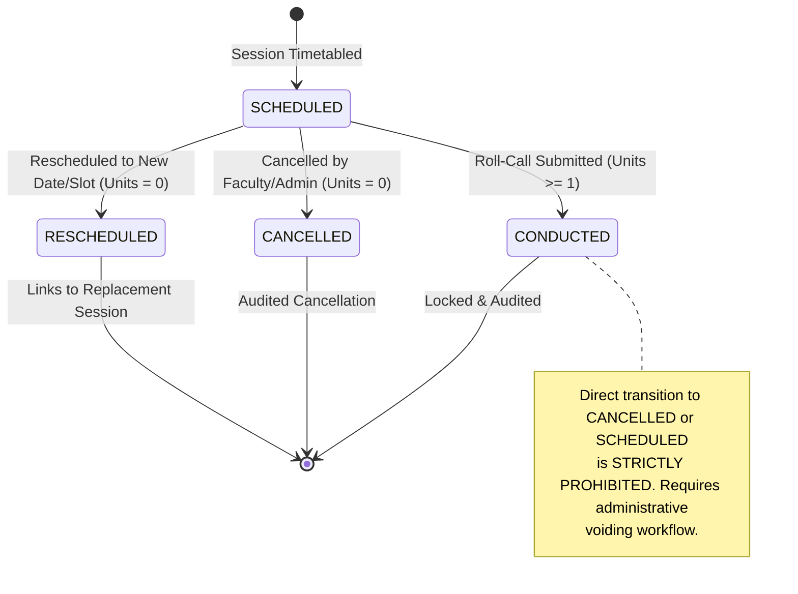

# Phase 3 Pre-Implementation Architecture Review

**Status:** Architecture Review Complete — Awaiting Approval  
**Date:** 2026-08-29  
**Scope:** Application Layer, REST API, Use Cases, Transaction Boundaries, State Machines, Concurrency, and Error Models.

---

## 1. Optimistic Locking Decision: Session vs. AttendanceRecord

### 1.1 Session: OPTIMISTIC LOCKING REQUIRED (`@Version`)
* **Rationale:** A class/lab session is a mutable lifecycle aggregate root. Sessions transition through states (`SCHEDULED` $\to$ `CONDUCTED`, `CANCELLED`, `RESCHEDULED`), can have dates or planned units updated, and can have attendance recorded or corrected.
* **Concurrency Risk:** If two instructors co-teaching a section attempt to submit roll-call simultaneously, or if an administrator reschedules a session while a faculty member is submitting attendance, a lost-update or race condition occurs.
* **Decision:** Add `@Version` (`version INT NOT NULL DEFAULT 0`) to `SessionEntity` via Flyway migration `V2__optimistic_locking.sql`. Any concurrent modification triggers Spring's `ObjectOptimisticLockingFailureException`, which maps cleanly to **HTTP 409 Conflict** (`OPTIMISTIC_LOCK_CONFLICT`).

### 1.2 AttendanceRecord: NO DIRECT `@Version` (Aggregate / Event Model)
* **Rationale:** An `AttendanceRecord` represents an atomic historical fact: *"Student $S$ was PRESENT in Session $X$."*
* Individual attendance records are **never** subjected to generic concurrent edits. When an attendance record is wrong, it is corrected through an explicit **Correction Business Operation** (`POST /api/v1/attendance/records/{id}/correction`) with reason, authorization, and audit capture.
* Adding `@Version` to millions of individual attendance records adds schema bloat without business benefit.
* **Decision:** Do **NOT** add `@Version` to `AttendanceRecordEntity`. Instead:
  1. The parent `SessionEntity.version` is touched whenever attendance is recorded or corrected.
  2. Corrections are executed as explicit audited events.
  3. Database uniqueness `uq_attendance_session_student` remains the authoritative concurrency guard against duplicate insertion.

---

## 2. Session State-Transition Model

A session is an explicit state machine with guarded transitions:



### Transition Invariants
| Current State | Target State | Permitted? | Invariants & Business Rules |
| :--- | :--- | :---: | :--- |
| `SCHEDULED` | `CONDUCTED` | **YES** | Planned units $\ge 1$; conducted units set to $\ge 1$; attendance records persisted atomically. |
| `SCHEDULED` | `CANCELLED` | **YES** | Conducted units set strictly to $0$; reason required; attendance records cannot be attached. |
| `SCHEDULED` | `RESCHEDULED` | **YES** | Conducted units set to $0$; replacement session ID required (`replaced_by_session_id`). |
| `CONDUCTED` | `CANCELLED` | **NO** | **Prohibited.** Once attendance facts are recorded, session cannot be cancelled without an audited Administrative Void operation. |
| `CONDUCTED` | `SCHEDULED` | **NO** | **Prohibited.** Cannot roll back conducted class to unconducted state. |
| `CANCELLED` | `CONDUCTED` | **NO** | **Prohibited.** Cancelled sessions cannot record attendance. A new session must be created. |
| `RESCHEDULED` | `CONDUCTED` | **NO** | **Prohibited.** Attendance must be recorded on the replacement session. |

---

## 3. Atomic Attendance Submission Workflow

Endpoint: `POST /api/v1/sessions/{sessionId}/attendance`

### Detailed Transaction Execution Sequence
```
1. Begin Transaction (@Transactional(isolation = READ_COMMITTED))
2. Acquire Session (with optimistic lock verification)
3. Guard: Verify session status == SCHEDULED (or idempotent check)
4. Guard: Verify session date is within academic period
5. Guard: Verify authenticated faculty is assigned to subject/section
6. Query: Fetch active student enrollments for section covering session date
7. Query: If session is LAB and labGroupId present, fetch active lab group memberships
8. Validate: Verify every submitted studentId is enrolled and eligible
9. Validate: Verify no duplicate studentIds exist within submitted payload
10. Domain Validation: Run pure AttendanceIntegrityValidator across batch
11. Persist: Insert all AttendanceRecordEntity instances via repository port
12. Transition: Set session.status = CONDUCTED, session.conductedUnits = session.plannedUnits
13. Increment: session.version bumped by JPA
14. Commit Transaction
```
**Failure Atomicity:** If any step (5 through 12) fails, the entire transaction rolls back. No partial roll-call records are ever committed.

---

## 4. Idempotency Strategy for Attendance Submission

* **The Problem:** Network timeout after server commit causes the client to retry `POST /api/v1/sessions/{sessionId}/attendance`.
* **Strategy: Deterministic Idempotent Verification**
  1. If a submission request arrives for a session that is **already `CONDUCTED`**:
  2. The service fetches the existing attendance records for the session.
  3. If the incoming student attendance map **exactly matches** the stored records, the service returns **HTTP 200 OK** with the existing `SessionAttendanceSummaryResponse` (Idempotent Success).
  4. If the incoming payload differs from existing records (or represents an attempt to overwrite), the service rejects the request with **HTTP 409 Conflict** (`SESSION_ALREADY_CONDUCTED`).
  5. The database unique constraint `uq_attendance_session_student` remains the non-bypassable final defense against concurrent duplicate insertion.

---

## 5. Attendance Correction Strategy

* Generic `PUT /api/v1/attendance/records/{id}` is **prohibited**.
* Dedicated Endpoint: `POST /api/v1/attendance/records/{id}/correction`
* **Request Payload:**
  * `newStatus` (AttendanceStatus enum string, e.g. `DUTY_LEAVE`, `PRESENT`)
  * `reason` (String, min 5 chars, max 500 chars, e.g. "Approved medical certificate #MC-104")
  * `approverId` (UUID of authorizing faculty/HOD)
* **Execution Boundary:**
  1. Load record and associated session.
  2. Verify session is `CONDUCTED`.
  3. Verify `newStatus != currentStatus`.
  4. Update record status.
  5. Touch `Session.updatedAt` and increment `Session.version`.
  6. Return `AttendanceCorrectionResponse` containing old status, new status, timestamp, and reason.
  7. Prepares clean audit hook for Phase 6 without implementing unnecessary premature complexity now.

---

## 6. Resource Management vs. Business Operations

The REST API strictly decouples **CRUD Resource Management** from **Business Operations**:

### Resource Management Endpoints
* `GET /api/v1/students/{id}` — Retrieve student profile
* `GET /api/v1/students` — Paginated student query
* `POST /api/v1/students` — Register student
* `PATCH /api/v1/students/{id}` — Update student contact details
* `GET /api/v1/subjects` — List curriculum subjects
* `GET /api/v1/academic/departments` — List departments
* `GET /api/v1/academic/periods` — List semesters/periods
* `GET /api/v1/academic/sections` — List sections

### Explicit Business Operation Endpoints
* `POST /api/v1/sessions/{id}/attendance` — Submit roll call (Atomic batch)
* `POST /api/v1/sessions/{id}/cancel` — Cancel scheduled session
* `POST /api/v1/sessions/{id}/reschedule` — Reschedule session to new slot
* `POST /api/v1/attendance/records/{id}/correction` — Audited status correction
* `POST /api/v1/enrollments/transfer` — Transfer student to new section
* `POST /api/v1/policies/{name}/versions` — Publish new immutable policy version
* `POST /api/v1/policies/{id}/activate` — Activate policy version

### Calculation & Projection Endpoints (Pure Domain Queries)
* `GET /api/v1/students/{id}/attendance/subjects/{subjectId}` — Subject-level calculation
* `GET /api/v1/students/{id}/attendance/overview` — All subjects summary
* `GET /api/v1/students/{id}/attendance/overall` — Institutional aggregation
* `GET /api/v1/students/{id}/attendance/subjects/{subjectId}/shortage` — Shortage and prediction ($x_{\min}, y_{\max}$)

---

## 7. Error Classification and HTTP Mapping

| Exception Class | HTTP Status | Public Error Code | Description |
| :--- | :---: | :--- | :--- |
| `HttpMessageNotReadableException` | **400** | `MALFORMED_JSON` | Invalid JSON syntax or unparseable request body. |
| `MethodArgumentNotValidException` | **400** | `VALIDATION_FAILED` | Bean Validation constraint failure (details list field errors). |
| `ResourceNotFoundException` | **404** | `RESOURCE_NOT_FOUND` | Student, Session, Subject, or Policy ID not found. |
| `DuplicateResourceException` | **409** | `DUPLICATE_RESOURCE` | Registration number, subject code, or policy version already exists. |
| `ObjectOptimisticLockingFailureException` | **409** | `OPTIMISTIC_LOCK_CONFLICT` | Resource was modified concurrently by another user. |
| `SessionStateConflictException` | **409** | `SESSION_STATE_CONFLICT` | Attempt to record attendance on cancelled/already-conducted session. |
| `AttendanceIntegrityException` | **422** | `INTEGRITY_VIOLATION` | Student unenrolled, wrong lab group, or session not conducted. |
| `StudentNotEligibleException` | **422** | `STUDENT_NOT_ELIGIBLE` | Student enrollment inactive on session date. |
| `InvalidSessionTransitionException` | **422** | `INVALID_STATE_TRANSITION` | Illegal session state machine transition attempt. |
| `Exception` (Unhandled) | **500** | `INTERNAL_SERVER_ERROR` | Sanitized generic server error. No SQL or stack traces exposed. |

---

## 8. Authorization Boundaries (Pre-Security Specification)

1. **Student Role:**
   * Can access `GET /api/v1/students/{id}/attendance/**` only where `{id}` matches current authenticated student.
   * Forbidden from session creation, attendance recording, corrections, or policy modifications.
2. **Faculty Role:**
   * Can view sessions, timetable, and student lists for assigned subjects/sections.
   * Can execute `POST /api/v1/sessions/{id}/attendance` only for sessions where `session.conductedByFacultyId == principal.facultyId`.
   * Can submit attendance corrections within institutional window.
3. **HOD / Admin Role:**
   * Full permissions: Academic structure management, enrollment transfers, policy versioning, session voiding/override.

---

## 9. Pagination and Query Limits

* Parameter names: `page` (0-indexed, default 0), `size` (default 20, max 100), `sortBy` (default `createdAt`), `sortDir` (`ASC` or `DESC`, default `DESC`).
* Applied to all collection endpoints (`/students`, `/faculty`, `/subjects`, `/sessions`, `/attendance/history`).
* Response wrapper:
  ```json
  {
    "content": [...],
    "page": 0,
    "size": 20,
    "totalElements": 150,
    "totalPages": 8,
    "first": true,
    "last": false
  }
  ```

---

## 10. Remaining Institutional Decisions (RICs)
1. **[RIC-P3-001] Session Voiding Policy:** Can a CONDUCTED session ever be voided/cancelled by HOD, or can individual records only be corrected? *(Default modeled: Conducted sessions cannot be cancelled directly; records are corrected).*
2. **[RIC-P3-002] Attendance Correction Window:** What is the maximum time window (e.g. 7 days, 14 days, end of semester) for faculty attendance corrections before requiring dean approval? *(Modeled as configurable application property).*
