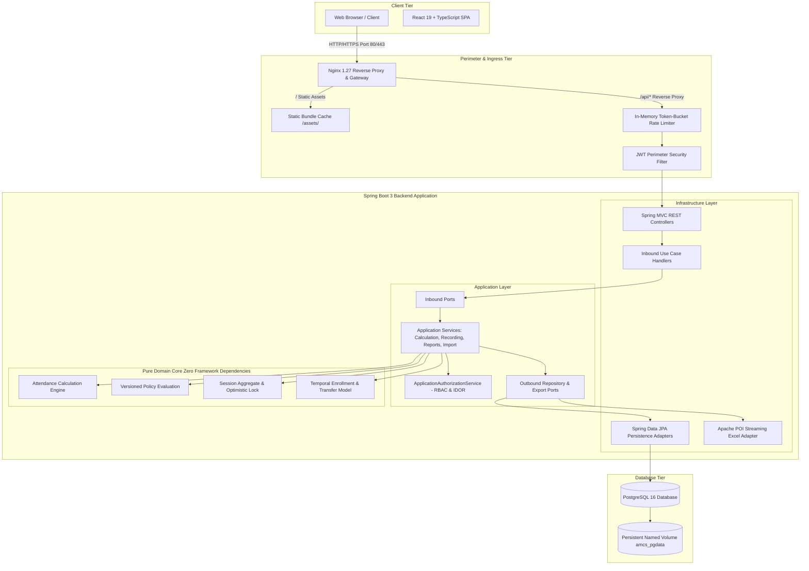

# Attendance Management and Calculation System (AMCS)

> An enterprise-grade, mathematically rigorous university attendance calculation and compliance platform built with Spring Boot 3, React 19, and PostgreSQL on strict Hexagonal Architecture.

[](https://github.com/organization/amcs/actions/workflows/ci.yml)
[](https://github.com/organization/amcs/releases/tag/v8.0.0)
[](https://openjdk.org/projects/jdk/21/)
[](https://spring.io/projects/spring-boot)
[](https://react.dev/)
[](https://www.typescriptlang.org/)
[](https://www.postgresql.org/)
[](https://www.docker.com/)
[](#11-testing)
[](#11-testing)

---

## 1. Project Overview

The **Attendance Management and Calculation System (AMCS)** replaces unreliable manual spreadsheets and fragile attendance trackers with an auditable, high-throughput academic platform. It models complex institutional realities—such as mid-semester section transfers with historical attendance preservation, multi-component theory/lab session aggregation, immutable versioned compliance policies, predictive shortage projections, and streaming low-memory Excel reporting.

---

## 2. Visual Showcase & Screenshots

> Below are reference captures demonstrating key role portals. In a live deployment, screenshot captures can be linked directly under `docs/screenshots/`.

| Portal | Preview / Description | Workflow Highlights |
|:---|:---|:---|
| **Student Dashboard** | `docs/screenshots/student_dashboard.png` | Live percentage gauges per subject, minimum threshold indicator, predictive recovery slider, and individual XLSX export. |
| **Faculty Roll Call** | `docs/screenshots/faculty_roll_call.png` | Streamlined one-click attendance recording (`PRESENT`, `ABSENT`, `DUTY_LEAVE`, `MEDICAL_LEAVE`), bulk status triggers, and section roster filters. |
| **HOD Administration** | `docs/screenshots/hod_dashboard.png` | Academic structure setup (Departments, Periods, Sections, Subjects), student/faculty rosters, and policy version editor. |
| **Report Generation** | `docs/screenshots/report_generation.png` | Generation and streaming download of official university registers (RPT-001 through RPT-008) in Excel format. |

---

## 3. Features by Role

### 🎓 Student
* **Attendance Overview:** Overall and course-by-course attendance percentages calculated in real time against active institutional policies.
* **Subject-Wise Analysis:** Granular breakdown of conducted vs. attended units, theory vs. practical sessions, and medical/duty leaves.
* **Shortage & Eligibility:** Immediate identification of attendance shortage status based on university thresholds (e.g., 75% or 85%).
* **Recovery Projection:** Interactive "what-if" mathematical simulation calculating exact future consecutive classes needed to regain exam eligibility.
* **Report Export:** Self-service streaming download of official Student Attendance Statements (RPT-001) in XLSX format.
* **Student Profile:** View registered academic period, enrolled section, student registration number, and linked institutional user account.

### 👨‍🏫 Faculty
* **Sessions Overview:** View all assigned timetable sessions filtered by date, section, and status (`SCHEDULED`, `CONDUCTED`, `CANCELLED`).
* **Timetable Management:** Create, reschedule, or cancel lecture and laboratory sessions for assigned courses.
* **Interactive Roll Call:** High-efficiency roll-call interface allowing individual student toggling or bulk status assignment (`ALL_PRESENT`).
* **Audited Attendance Corrections:** Submit post-conducted adjustments with mandatory reason text, tracked in immutable audit logs with approver records.
* **Institutional Reports:** Instant XLSX export of Course Attendance Summaries (RPT-002), Section Attendance Sheets (RPT-003), and Attendance Registers (RPT-004).

### 🏛️ HOD & Academic Administrator
* **Academic Structure:** Manage Departments, Academic Periods (semesters/terms), Sections, Subjects, and Credit Allocations.
* **Students & Faculty Directory:** Full lifecycle management for student registrations, faculty assignments, and user authentication accounts.
* **Sections & Temporal Enrollments:** Enroll students with explicit start and end dates; perform inter-section transfers while preserving past attendance history in previous sections.
* **Attendance Policies:** Create and version institutional compliance policies (minimum attendance %, component weighting, duty-leave treatment).
* **Two-Phase Excel Bulk Import:** Upload bulk spreadsheets (Students, Faculty, Timetables, Sessions) with automatic validation, preview, error reporting, and transactional commit.
* **Comprehensive Reporting:** Access all 8 official institutional Excel reports (RPT-001 through RPT-008).

---

## 4. System Architecture

AMCS is implemented as a **Hexagonal Architecture** (Ports and Adapters) system, ensuring complete independence between business logic, frameworks, and infrastructure.



---

## 5. Technology Stack & Design Decisions

| Technology | Role | Technical Justification |
|:---|:---|:---|
| **Java 21 (LTS)** | Backend Runtime | Strong typing, modern language features (Records, Pattern Matching), predictable GC performance with G1GC, long-term enterprise support. |
| **Spring Boot 3.3.3** | Application Framework | Robust ecosystem, production-ready observability (Actuator), declarative transactions (`@Transactional`), and dependency injection. |
| **PostgreSQL 16** | Relational Database | ACID compliance, strict foreign-key integrity, performant indexing, and battle-tested transactional concurrency. |
| **Flyway 10.x** | Schema Migrations | Version-controlled, immutable database schema evolution executed on startup with zero drift. |
| **Spring Security 6.3 + JJWT** | Auth & Perimeter | Stateless HMAC-SHA256 JWT tokens with database-backed `tokenVersion` check enabling instant multi-device revocation. |
| **Apache POI 5.3.0 (SXSSF)** | Excel Processing | Low-memory streaming generation (`SXSSFWorkbook`) and StAX XML parsing preventing heap exhaustion during large roster exports. |
| **React 19 + TypeScript 5** | Frontend SPA | Component-driven UI, compile-time type safety preventing contract bugs, and deterministic state management. |
| **Vite 8** | Frontend Tooling | Near-instant hot module replacement (HMR) and optimized Rollup production asset bundles. |
| **Nginx 1.27 Alpine** | Reverse Proxy & Gateway | Static asset caching with HTTP gzip compression, single-point TLS termination, and SPA HTML5 history fallback (`try_files`). |
| **Docker & Compose** | Containerization | Multi-stage slim container builds, isolated internal networking, non-root user execution, and reproducible environments. |
| **GitHub Actions** | CI/CD Pipeline | Automated linting, multi-suite unit testing, production compilation, and Docker image build verification on every pull request. |

---

## 6. Architectural Principles

AMCS intentionally avoids framework coupling and arbitrary architecture patterns in favor of proven software engineering practices:

1. **Strict Hexagonal Architecture (Ports and Adapters):**
   - The domain core (`com.amcs.domain.*`) has **zero dependencies** on Spring, JPA, Hibernate, or HTTP libraries. It consists purely of immutable Java records, domain exceptions, and deterministic calculation logic.
   - Application services coordinate workflows and domain logic via input ports and communicate with external resources exclusively through output interfaces (ports).
2. **Dependency Inversion:**
   - Outbound repository interfaces reside in the application layer. Infrastructure persistence adapters implement these interfaces, ensuring data stores depend on domain contracts, never the reverse.
3. **Optimistic Locking for Concurrent Roll-Call:**
   - The mutable `sessions` table uses JPA `@Version` column locking. When multiple staff members attempt simultaneous attendance submissions for the same session, conflicts are caught cleanly without data corruption.
4. **Temporal Enrollment Model:**
   - Student section enrollments track `startDate` and `endDate`. Mid-semester transfers close the previous enrollment window and open a new one; attendance calculations evaluate sessions against the active enrollment window at the session date.
5. **Immutable Policy Versioning:**
   - University attendance policies (minimum % threshold, component weights, medical/duty leave rules) are versioned. When an updated policy is published, previous semesters remain bound to the policy version active during that academic term.
6. **Service-Layer Authorization & IDOR Defense:**
   - Beyond role-based URL filtering, `ApplicationAuthorizationService` enforces context-aware ownership. Students can only request their own records; faculty can only conduct sessions for courses and sections assigned to them.

---

## 7. Security Architecture

Implemented security controls verified in code:

* **Stateless JWT with Instant Revocation:** Tokens carry a signed `tokenVersion`. Password updates or administrative lockouts increment the user's `tokenVersion` in PostgreSQL, instantly invalidating all active JWTs.
* **Perimeter Role-Based Access Control (RBAC):** Granular authorization across `STUDENT`, `FACULTY`, and `HOD_ADMIN` roles enforced at Spring Security perimeter and verified at service entry points.
* **In-Memory Token-Bucket Rate Limiter:** Protects authentication (`/api/v1/auth/login` at 10 req/min) and expensive endpoints (`/api/v1/imports/**`, `/api/v1/reports/**` at 25 req/min).
* **Anti-Spoofing Client IP Handling:** Reverse proxy overwrites `X-Real-IP` with `$remote_addr`. The backend `RateLimitingFilter` prioritizes `X-Real-IP`, preventing IP spoofing via arbitrary `X-Forwarded-For` injection.
* **Password Hashing:** BCrypt with work factor 12 and mandatory password complexity verification.
* **Spreadsheet Attack Mitigation:**
  * Strict ZIP-bomb compression ratio verification (< 20.0).
  * XML External Entity (XXE) injection disabled across all XML parsers.
  * CSV/Excel Formula Injection (CWE-1236) sanitization prefixing dangerous formula symbols (`=`, `+`, `-`, `@`) with a single apostrophe.
* **Non-Root Container Security:** Spring Boot container executes under dedicated system user `amcs:amcs` (UID `10001`, GID `10001`) with no login shell.
* **Production Secret Fail-Fast:** Application startup immediately halts if default fallback secrets are detected under the `prod` profile.
* **Restricted Actuator Surface:** Only `/actuator/health` and `/actuator/info` are exposed publicly; administrative and diagnostic endpoints are withheld from the public gateway.

---

## 8. Database Architecture

* **Engine:** PostgreSQL 16 Alpine.
* **Schema Ownership:** Managed exclusively by **Flyway**. Schema creation and incremental migrations are version-controlled in SQL files under `src/main/resources/db/migration/`.
* **Hibernate Integration:** Locked to `ddl-auto: validate` in production, ensuring Hibernate never alters the database schema independently.
* **Data Integrity:** Strict foreign key constraints with cascading rules, unique indexes on natural keys (e.g., registration numbers, section codes), and audit timestamps on all records.
* **Optimistic Locking:** Enforced on mutable transaction entities (`sessions`) via `@Version` columns.
* **Persistence:** State is backed by a Docker named volume (`amcs_pgdata`) that persists data across container restarts and updates.

---

## 9. Running Locally

### Prerequisites
* Java 21 JDK
* Node.js 20+ & npm 10+
* Docker & Docker Compose
* Maven 3.9+ (or `./mvnw`)

### 1. Start Local PostgreSQL
```bash
docker compose up -d postgres
```

### 2. Start Backend (Development Profile)
```bash
mvn spring-boot:run
```
* API Base: `http://localhost:8080/api/v1`
* Swagger UI: `http://localhost:8080/swagger-ui.html`
* Actuator Health: `http://localhost:8080/actuator/health`

### 3. Start Frontend Dev Server
```bash
cd frontend
npm install
npm run dev
```
* Frontend Web UI: `http://localhost:5173`

---

## 10. Production Deployment

AMCS deploys as a cohesive 3-service stack managed by `docker-compose.prod.yml`:

```bash
# 1. Copy production environment template
cp .env.example .env
chmod 600 .env

# 2. Fill in secure credentials in .env (DB password, JWT secret, CORS domain)
nano .env

# 3. Build and launch the production stack
docker compose -f docker-compose.prod.yml up -d --build

# 4. Verify that all 3 services are healthy
docker compose -f docker-compose.prod.yml ps
curl -I http://localhost/actuator/health
```

For zero-downtime deployment workflows, rolling updates, pre-flight checklists, and disaster recovery procedures, see [PRODUCTION_DEPLOYMENT.md](file:///Users/roy/Documents/coding/fun/attendance/PRODUCTION_DEPLOYMENT.md).

---

## 11. Testing

AMCS maintains 100% automated test pass rates across all test suites:

| Suite | Scope | Command | Results |
|:---|:---|:---|:---:|
| **Backend Tests** | Domain unit tests, calculation invariants, mathematical bounds, service mocks, repository queries, Spring Security, JWT authentication, and REST controller integration. | `mvn clean test` | **567 / 567 passed** (0 failures, 0 errors) |
| **Frontend Tests** | Vitest unit and integration tests for auth state, navigation, API clients, and error boundaries. | `cd frontend && npm test -- --run` | **8 / 8 passed** (0 failures, 0 errors) |
| **Frontend Linter** | ESLint static analysis checking syntax, imports, and component conventions. | `cd frontend && npm run lint` | **0 errors** (58 warnings) |
| **Production Build** | TypeScript strict compilation and Vite production asset bundler. | `cd frontend && npm run build` | **Clean build** (469ms) |
| **Production Smoke** | End-to-end containerized verification of health probes, multi-role auth, HOD setup, Faculty roll-call, Student calculations, Excel binary downloads, and PostgreSQL database row persistence. | `python3 verify_production_stack.py` | **100% passed** |

---

## 12. Development Demo Credentials

> ⚠️ **DEVELOPMENT / DEMO ONLY:** These accounts are seeded exclusively when `AMCS_BOOTSTRAP_ENABLED=true`. In production environments, bootstrapping is disabled, and demo credentials do not exist.

| Role | Username | Password | Purpose |
|:---|:---|:---|:---|
| **HOD_ADMIN** | `admin` | `AdminPassword123!` | Academic configuration, section enrollments, policy editor, report generation |
| **FACULTY** | `faculty1` | `FacultyPassword123!` | Roll-call conductor (Assigned to CS301 Operating Systems in Section CSE-A) |
| **STUDENT** | `student1` | `StudentPassword123!` | Alice Smith (`REG2026001`) — Full attendance calculations and recovery projection |
| **STUDENT** | `student2` | `StudentPassword123!` | Bob Jones (`REG2026002`) — Defaulter threshold tracking |

---

## 13. Known Limitations & Operational Considerations

1. **TLS / SSL Certificate Termination:**
   - The production Compose setup provides a hardened HTTP reverse proxy. In production internet environments, TLS must be terminated by mounting genuine certificates into Nginx (using [`frontend/nginx.ssl.conf.template`](file:///Users/roy/Documents/coding/fun/attendance/frontend/nginx.ssl.conf.template)) or via a cloud load balancer (AWS ALB, Cloudflare).
2. **Single-Instance Rate Limiting:**
   - The built-in token-bucket rate limiter stores state in JVM memory (`ConcurrentHashMap`), which is optimal for a single backend instance. For horizontal scaling across multiple container replicas, rate limiting should be delegated to Redis or enforced at the reverse proxy / API gateway edge.
3. **Database Backup Strategy:**
   - The production stack persists data to named volume `amcs_pgdata`. Off-site backup automation via scheduled `pg_dump` jobs should be provisioned as part of operational infrastructure.

---

## 14. Additional Documentation

* [**Architecture Guide**](file:///Users/roy/Documents/coding/fun/attendance/docs/ARCHITECTURE.md) — Deep-dive into hexagonal architecture, calculation pipelines, concurrency, and security.
* [**Technical Interview Guide**](file:///Users/roy/Documents/coding/fun/attendance/docs/INTERVIEW_GUIDE.md) — 35+ project-specific backend interview Q&As with code references.
* [**Live Demo Script**](file:///Users/roy/Documents/coding/fun/attendance/docs/DEMO_SCRIPT.md) — 5–7 minute walkthrough script for presentations and technical showcases.
* [**Resume & Portfolio Bullets**](file:///Users/roy/Documents/coding/fun/attendance/docs/RESUME_BULLETS.md) — Ready-to-use bullet points tailored for Java Backend, Full-Stack, and System Design profiles.
* [**Production Deployment Guide**](file:///Users/roy/Documents/coding/fun/attendance/PRODUCTION_DEPLOYMENT.md) — Complete operational deployment and disaster recovery runbook.
* [**Release Notes v8.0.0**](file:///Users/roy/Documents/coding/fun/attendance/docs/RELEASE_v8.0.0.md) — Official v8.0.0 release log.
