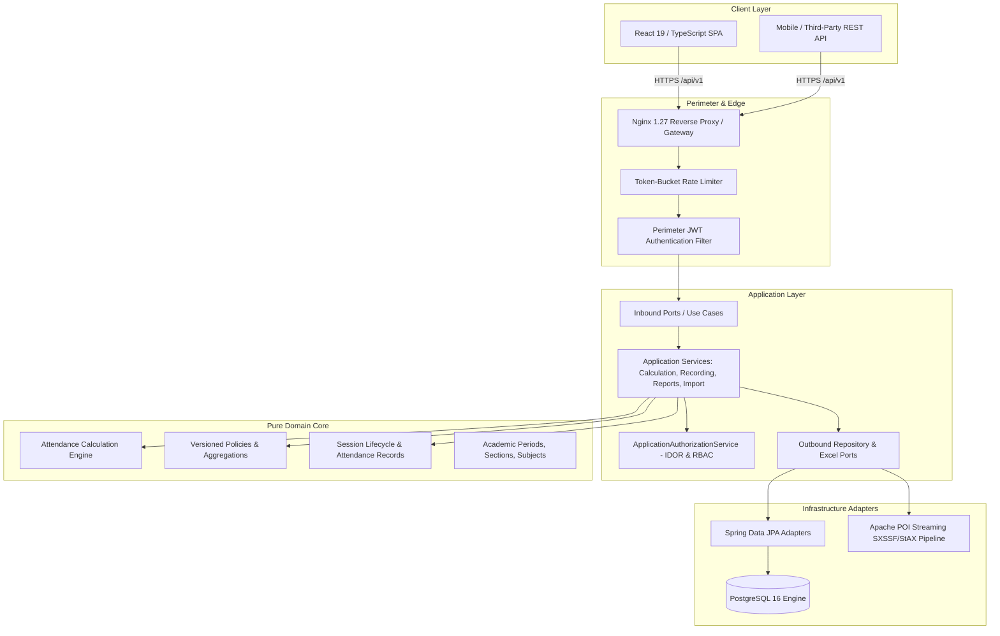

# Attendance Management and Calculation System (AMCS)

[](https://github.com/organization/amcs/actions/workflows/ci.yml)
[](https://github.com/organization/amcs/releases/tag/v8.0.0)
[](https://openjdk.org/projects/jdk/21/)
[](https://spring.io/projects/spring-boot)
[](https://react.dev/)
[](https://www.typescriptlang.org/)
[](https://www.postgresql.org/)
[](LICENSE)

The **Attendance Management and Calculation System (AMCS)** is an enterprise-grade university attendance platform built on strict **Hexagonal Architecture** (Ports and Adapters). It replaces error-prone manual spreadsheets with a high-throughput, mathematically rigorous, and auditable system supporting complex university attendance policies, streaming Excel ingestion, real-time shortage projections, and granular role-based access control.

---

## 1. System Architecture

AMCS enforces complete isolation of core academic and calculation business rules from databases, frameworks, and web controllers.



### Core Architecture Highlights:
* **Zero-Dependency Domain Core:** `com.amcs.domain.*` contains no Spring, JPA, or web framework imports. Pure Java 21 records and immutability.
* **Instant Token Invalidation:** JWT claims store `tokenVersion`. Every authenticated request verifies the version against PostgreSQL, enabling instant multi-device revocation on password change or administrative lockout.
* **Optimistic Locking:** The mutable `sessions` aggregate root uses `@Version` column locking to guarantee lost updates are prevented during concurrent roll-call sessions.
* **Streaming Low-Memory Excel Engine:** Apache POI `SXSSFWorkbook` and StAX XML parsing process datasets with constant O(1) heap memory, bounded by pre-ingestion zip-bomb, XXE, and formula injection inspectors.

---

## 2. Technology Stack

| Layer | Technologies | Purpose |
|:---|:---|:---|
| **Backend Core** | Java 21 (LTS), Spring Boot 3.3.3 | Enterprise application container and dependency injection |
| **Persistence** | PostgreSQL 16+, Spring Data JPA, Hibernate 6.5 | Relational data persistence with strict constraints |
| **Migrations** | Flyway Community Edition 10.x | Version-controlled, reproducible database schema migrations |
| **Security** | Spring Security 6.3, JJWT 0.12.6, BCrypt (strength 12) | Perimeter authentication, JWT generation/validation, token revocation |
| **Excel Engine** | Apache POI 5.3.0, POI-OOXML | Streaming XLSX generation (SXSSF) and memory-bounded import parsing |
| **Frontend Core** | React 19.2, TypeScript 5.x, Vite 8.x | Single Page Application (SPA) with strict type safety |
| **Frontend UI** | Tailwind CSS 3.4, Lucide React, clsx | Modern responsive design with accessible layout components |
| **Reverse Proxy** | Nginx 1.27 Alpine | TLS termination, gzip compression, SPA routing fallback, API proxy |
| **Testing** | JUnit 5, Mockito, AssertJ, Vitest, Testing Library | Comprehensive unit and integration test coverage across all layers |

---

## 3. Features by Institutional Role

### 🎓 Student Portal (`/student/*`)
* **Real-Time Calculation Dashboard:** Overall and subject-by-subject attendance percentages calculated against active university policies.
* **Interactive Shortage Forecaster:** "What-if" mathematical simulation calculating exact future classes needed to recover from shortage or achieve target percentiles (e.g. 75% or 85%).
* **Attendance History & Profile:** Component breakdowns (Theory vs. Lab), absent dates, and registration records.
* **Strict IDOR Guard:** Students are cryptographically prevented from viewing or calculating data for any other student.

### 👨‍🏫 Faculty Portal (`/faculty/*`)
* **Live Roll-Call Interface:** Optimized single-screen roster with batch submission (`PRESENT`, `ABSENT`, `DUTY_LEAVE`, `MEDICAL_LEAVE`).
* **Audited Correction Engine:** Submit post-conducted adjustments with mandatory reason justification tracked in immutable audit logs.
* **Teaching Scope Enforcement:** Faculty members can strictly only schedule, conduct, or modify sessions for sections and subjects they are assigned to teach in the current period.
* **Institutional Reports:** Instant download of Course Attendance Summaries (RPT-002), Attendance Registers (RPT-004), and Defaulter Predictions (RPT-008).

### 🏛️ HOD & Administrator Portal (`/admin/*`)
* **Academic Master Data:** Academic Periods, Departments, Sections, Subjects, and Credit Hours.
* **Faculty & Student Directory:** User account creation, institutional identity linking, and credential management.
* **Teaching & Section Enrollments:** Assign instructors to class sections; enroll students with start/end date temporal tracking; handle mid-term transfers.
* **Immutable Attendance Policies:** Versioned policies with configurable minimum thresholds, component weights, and absent strategies.
* **Two-Phase Excel Bulk Import Center:** Stage, validate, preview row errors, and commit or discard bulk uploads (Students, Sessions, Attendance Records).
* **Enterprise Reporting Center:** Full suite of official university registers (RPT-001 through RPT-008) exported as production-formatted Excel sheets.

---

## 4. Quick Start — Local Development

### Prerequisites
* **Java 21** JDK (Eclipse Temurin or OpenJDK)
* **Node.js 20+** and `npm 10+`
* **Docker Engine** & **Docker Compose** (for PostgreSQL)
* **Maven 3.9+** (or bundled `./mvnw`)

### Step 1: Start Local Database
```bash
docker compose up -d postgres
```

### Step 2: Build & Start Spring Boot Backend
```bash
# Run full test suite to verify environment
mvn clean test

# Launch backend with dev profile (auto-seeds baseline university structure)
mvn spring-boot:run
```
* Backend API: `http://localhost:8080/api/v1`
* OpenAPI / Swagger UI: `http://localhost:8080/swagger-ui.html`
* Actuator Health: `http://localhost:8080/actuator/health`

### Step 3: Start React Frontend
```bash
cd frontend
npm install
npm run dev
```
* Frontend UI: `http://localhost:5173`

---

## 5. Development Demo Credentials

> ⚠️ **IMPORTANT NOTICE:** These credentials are automatically initialized **ONLY** when `AMCS_BOOTSTRAP_ENABLED=true` (development mode). They are strictly disabled and prohibited in production environments.

| Role | Username | Password | Purpose |
|:---|:---|:---|:---|
| **HOD_ADMIN** | `admin` | `AdminPassword123!` | Academic configuration, policies, enrollments, reports |
| **FACULTY** | `faculty1` | `FacultyPassword123!` | Roll-call conductor (Assigned to CS301 / CSE-A) |
| **STUDENT** | `student1` | `StudentPassword123!` | Alice Smith (Reg: `2024CS001`) — Dashboard & Shortage |
| **STUDENT** | `student2` | `StudentPassword123!` | Bob Jones (Reg: `2024CS002`) — Defaulter threshold testing |

---

## 6. Production Deployment

AMCS is deployed as a hardened 3-tier container stack orchestrated by Docker Compose:

```
                  ┌────────────────────────────────────────┐
                  │          Host Port 80 / 443            │
                  └───────────────────┬────────────────────┘
                                      │
                                      ▼
                       ┌─────────────────────────────┐
                       │  amcs-frontend (Nginx 1.27) │
                       │   - React SPA (Cached)      │
                       │   - Reverse Proxy (/api/)   │
                       └──────────────┬──────────────┘
                                      │ (Internal Docker Network)
                                      ▼
                       ┌─────────────────────────────┐
                       │  amcs-backend (Java 21 JRE) │
                       │   - Non-root UID 10001      │
                       │   - Spring Boot Actuator    │
                       └──────────────┬──────────────┘
                                      │
                                      ▼
                       ┌─────────────────────────────┐
                       │  amcs-postgres (Postgres 16)│
                       │   - Persistent Named Volume │
                       └─────────────────────────────┘
```

### 6.1 Production Quick Deploy
```bash
# 1. Clone repository and select target release
git checkout v8.0.0

# 2. Configure environment secrets
cp .env.example .env
chmod 600 .env
nano .env

# 3. Launch production stack
docker compose -f docker-compose.prod.yml up -d --build

# 4. Verify service health
docker compose -f docker-compose.prod.yml ps
curl -I http://localhost/actuator/health
```

For complete step-by-step pre-flight checklists, zero-downtime instructions, and rollback runbooks, refer to [PRODUCTION_DEPLOYMENT.md](file:///Users/roy/Documents/coding/fun/attendance/PRODUCTION_DEPLOYMENT.md).

---

## 7. Environment Variables Reference

| Variable | Default Value | Production Requirement | Description |
|:---|:---|:---|:---|
| `POSTGRES_DB` | `amcs_db` | Configurable | PostgreSQL database name |
| `POSTGRES_USER` | `amcs_user` | **Mandatory Secure Value** | PostgreSQL administrator username |
| `POSTGRES_PASSWORD` | *None* | **Mandatory Strong Secret** | Database password (min 24 characters) |
| `AMCS_JWT_SECRET` | *None* | **Mandatory Cryptographic Key** | Min 256-bit (32 bytes) HMAC-SHA256 secret key |
| `AMCS_JWT_ISSUER` | `amcs-auth-service` | Configurable | JWT token issuer string |
| `AMCS_JWT_EXPIRATION_SECONDS` | `3600` | Configurable | Token validity duration in seconds (default 1h) |
| `AMCS_CORS_ALLOWED_ORIGINS` | `https://amcs.university.edu` | **Mandatory HTTPS Origin** | Allowed origins for cross-origin browser requests |
| `AMCS_BOOTSTRAP_ENABLED` | `false` in prod | **Strictly False in Prod** | Disables demo accounts & sample classes |
| `SPRING_PROFILES_ACTIVE` | `prod` | `prod` | Activates production database pools & security |
| `HTTP_PORT` | `80` | Host specific | Public gateway HTTP port |
| `HTTPS_PORT` | `443` | Host specific | Public gateway HTTPS port (when TLS configured) |
| `SPRING_DATASOURCE_HIKARI_MAX_POOL_SIZE`| `20` | Tunable (10-50) | Maximum Hikari database connection pool size |

---

## 8. Verification & Testing

AMCS maintains 100% automated test pass rates across both frontend and backend suites:

```bash
# 1. Run full backend test suite (Unit, Integration, Architecture, Security)
mvn clean test

# 2. Run frontend unit tests (Vitest)
cd frontend && npm test

# 3. Run frontend linter (oxlint)
cd frontend && npm run lint

# 4. Run frontend production compilation check
cd frontend && npm run build
```

* **Backend Tests:** 567 passed, 0 failures, 0 errors, 0 skipped.
* **Frontend Tests:** 8 passed, 0 failures, 0 errors.
* **TypeScript Compilation:** 0 errors.

---

## 9. Security Model & Production Hardening

* **Principle of Least Privilege:** Backend container executes strictly as non-root user `amcs:amcs` (`UID 10001, GID 10001`) with no shell login (`/sbin/nologin`).
* **In-Memory Token-Bucket Rate Limiter:** Protects `/api/v1/auth/login` (10 req/min), `/api/v1/imports/**` (25 req/min), and `/api/v1/reports/**` (25 req/min).
* **IP Spoofing Countermeasure:** The Nginx reverse proxy overwrites `X-Real-IP` and `X-Forwarded-For` with `$remote_addr`. The backend rate limiter prioritizes `X-Real-IP`, preventing bypass via client-forged headers.
* **Spreadsheet Attack Defenses:**
  * Strict ZIP bomb decompression ratio caps (< 20.0).
  * XML External Entity (XXE) injection disabled in SAX/StAX readers.
  * Formula Injection (CSV/Excel Macro CWE-1236) sanitized with single-quote escaping on formula trigger characters (`=`, `+`, `-`, `@`, `\t`, `\r`).
* **Production Secret Fail-Fast:** `JwtProperties` throws an `IllegalStateException` on startup if `DEV_FALLBACK_SECRET` is detected under the `prod` profile.

---

## 10. Operational Limitations & Scale Architecture

1. **Clustered Rate Limiting:** The default `RateLimitingFilter` stores token buckets in JVM memory (`ConcurrentHashMap`), which is optimal for single-node deployments. For multi-replica Kubernetes clusters, rate limiting must be offloaded to Redis or enforced at the API Gateway / Cloudflare / AWS WAF edge.
2. **Reverse Proxy Placement:** When deploying behind institutional cloud load balancers (AWS ALB, GCP Cloud Load Balancing, Cloudflare), configure `server.forward-headers-strategy: framework` and declare trusted proxy IP ranges.
3. **Database Scaling:** PostgreSQL should be backed by SSD storage with regular `VACUUM ANALYZE` maintenance schedules and automated off-site snapshot backups.
