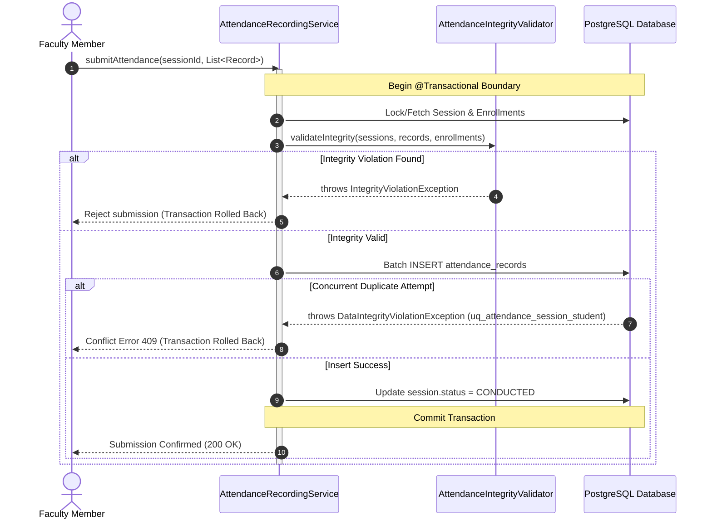

# Transaction Boundaries and Concurrency Design

## 1. Overview & Architectural Principles

Attendance management operations involve multi-entity operations (e.g., creating a conducted session and inserting 60 student attendance records). 

To ensure ACID guarantees without distributed locks or complex sagas, AMCS follows clear transaction boundary rules:

1. **Transactional Units of Work:** Single-database transactions managed by Spring's `@Transactional`.
2. **Database Constraints as the Final Defense:** Concurrency safety (e.g. duplicate submissions) is never delegated solely to in-memory checks; it is strictly guaranteed by relational constraints (`uq_attendance_session_student`).
3. **Fail-Fast & Atomic Rollback:** Any validation failure or integrity violation causes complete rollback of the session and its records.

---

## 2. Core Transaction Boundaries



### 2.1 Session Creation & Roll-Call Batch Submission
* **Transaction Scope:** `@Transactional(isolation = Isolation.READ_COMMITTED, rollbackFor = Exception.class)`
* **Operation Sequence:**
  1. Verify active enrollment for each student in the target section.
  2. Verify faculty assignment and session timetable boundaries.
  3. Insert/Update `SessionEntity` with `status = CONDUCTED` and `conductedUnits >= 1`.
  4. Perform batch insert of `AttendanceRecordEntity` instances for all students.
* **Failure Guarantee:** If any student record fails (e.g., duplicate record, invalid foreign key), the entire batch rolls back. No partial session exists.

---

## 3. Concurrency Defense & Race Condition Mitigation

### 3.1 Double-Submission / Double-Click Race Condition
* **Scenario:** Faculty clicks "Submit Attendance" twice in rapid succession, or two co-instructors submit attendance for the same laboratory group simultaneously.
* **Vulnerability of Application-Only Check:**
  ```java
  // VULNERABLE: Two concurrent threads both evaluate to false
  if (!recordRepository.existsBySessionAndStudent(sessionId, studentId)) {
      recordRepository.save(record);
  }
  ```
* **Production Defense:**
  PostgreSQL enforces the unique constraint:
  ```sql
  CONSTRAINT uq_attendance_session_student UNIQUE (session_id, student_id)
  ```
  The second thread receives a `DataIntegrityViolationException` from the PostgreSQL driver, rolling back the duplicate submission cleanly and idempotently.

---

## 4. Error Observability and Classification

Persistence and application exceptions are classified into clear semantic categories:

| Error Category | Root Cause / Trigger | Database / Exception Indicator | Future API Mapping |
| :--- | :--- | :--- | :--- |
| **Validation Error** | Conducted units < 1, session date outside semester | `IllegalArgumentException`, `IllegalStateException` | HTTP 400 Bad Request |
| **Duplicate / Conflict** | Duplicate attendance record, repeated policy version | `DataIntegrityViolationException` (`uq_attendance_session_student`) | HTTP 409 Conflict |
| **Foreign Key Violation** | Non-existent student, invalid department ID | `DataIntegrityViolationException` (`fk_*`) | HTTP 422 Unprocessable Entity |
| **Integrity Corruption** | Student not enrolled, wrong lab group | `AttendanceIntegrityException` | HTTP 422 Unprocessable Entity |
| **Entity Not Found** | Querying non-existent session or policy | `NoSuchElementException`, empty `Optional` | HTTP 404 Not Found |
| **Database Unavailable** | Connection timeout, database down | `CannotCreateTransactionException`, `JDBCConnectionException` | HTTP 503 Service Unavailable |
